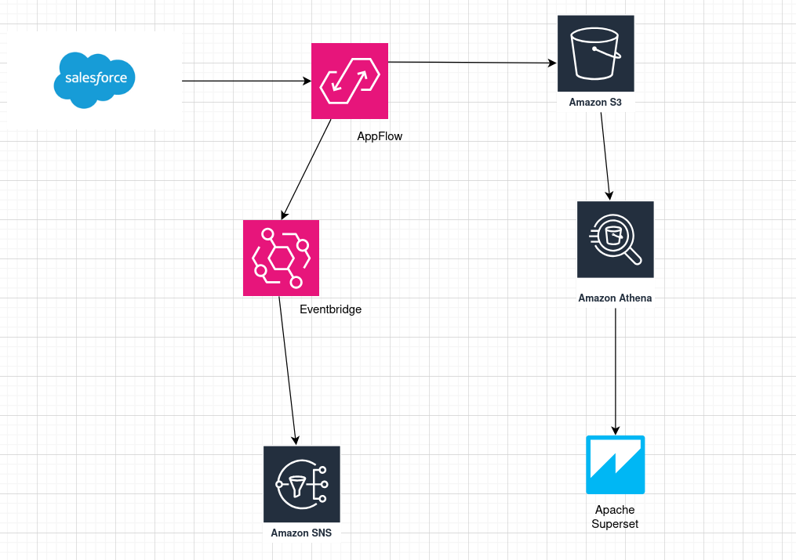

# Salesforce → AWS AppFlow → S3 → Athena → Superset Data Pipeline

This project demonstrates a **data analytics pipeline** that integrates **Salesforce CRM** data into **AWS analytics services** for real-time reporting and visualization.

---

## Overview

**Goal:** Generate daily sales performance insights by extracting Salesforce data using **AWS AppFlow**, storing it in **S3**, querying with **Athena**, and visualizing using **Apache Superset**.

---

##  Architecture



**Flow:**
1. Salesforce → AppFlow → S3 (Raw JSON files)
2. Athena → Query & transform data in-place on S3
3. Superset → Visualize data from Athena

---

## AWS Components

| Service | Purpose |
|----------|----------|
| **AWS AppFlow** | Connects Salesforce to S3 automatically |
| **Amazon S3** | Stores Salesforce object exports (Accounts, Leads, etc.) |
| **Athena** | SQL query engine for JSON/CSV data in S3 |
| **Apache Superset** | Dashboards & visualization |
| **AWS Glue (optional)** | Schema detection & ETL |
| **AWS Eventbridge**  | Captures AppFlow “End Flow Run Report” events (success or failure).|
| **SNS**  | Sends notifications (via email or SMS) when AppFlow runs complete. |
| **Email Notification**  | Informs team members that a Salesforce → S3 data sync just finished (or failed). |

---

## Athena Tables

```sql
CREATE EXTERNAL TABLE salesforce_leads (
  Name string,
  Company string,
  Phone string,
  Email string,
  Status string,
  CreatedDate string
)
ROW FORMAT SERDE 'org.openx.data.jsonserde.JsonSerDe'
LOCATION 's3://my-sales-data/salesforce/leads/';

CREATE EXTERNAL TABLE IF NOT EXISTS salesforce_opportunities (
  StageName STRING,
  Amount DOUBLE,
  CloseDate DATE,
  Name STRING
)
ROW FORMAT SERDE 'org.openx.data.jsonserde.JsonSerDe'
LOCATION 's3://my-sales-data/salesforce/opportunities/';
